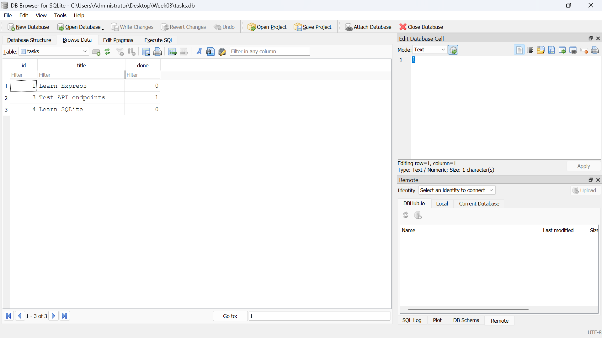
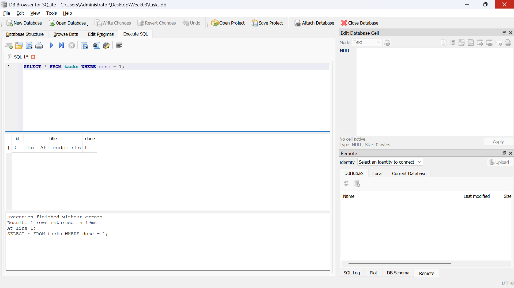

# Week 3 – Express.js Task API with SQLite

## Overview

This project is a RESTful Task Management API built using **Node.js**, **Express.js**, and **SQLite**. It extends the Week 2 CRUD API by replacing the in-memory array with a persistent SQLite database using the **better-sqlite3** package.

The application automatically creates the database and the `tasks` table when it starts. If the table is empty, three example tasks are inserted automatically. All CRUD operations are performed using parameterized SQL queries, ensuring data persistence and improved security.

---

# Features

- RESTful CRUD API
- SQLite database integration
- Automatic database creation
- Automatic table creation
- Seed data inserted only once
- Persistent storage
- Prepared SQL statements
- Parameterized queries
- Input validation
- Search tasks
- Filter completed/pending tasks
- Sort tasks
- Statistics endpoint
- Swagger API documentation

---

# Technologies Used

- Node.js
- Express.js
- SQLite
- better-sqlite3
- Swagger UI
- JavaScript (ES6)

---

# Why SQLite?

SQLite was selected because it is:

- Lightweight
- Serverless
- Easy to configure
- Stores data inside a single file (`tasks.db`)
- Automatically creates the database
- Persists data after server restarts

This makes SQLite an ideal database for small REST APIs and learning database integration.

---


# Database Screenshot

The screenshot below shows the `tasks` table opened in **DB Browser for SQLite**.



---

# SQL Query Executed

The following SQL query was executed manually inside DB Browser for SQLite.

```sql
SELECT * FROM tasks WHERE done = 1;
```

This query returns all completed tasks stored in the database.



---

# API Endpoints

| Method | Endpoint | Description |
|---------|----------|-------------|
| GET | /tasks | Retrieve all tasks |
| GET | /tasks/:id | Retrieve a task by ID |
| POST | /tasks | Create a new task |
| PUT | /tasks/:id | Update an existing task |
| DELETE | /tasks/:id | Delete a task |
| GET | /stats | Database statistics |

---

# Search

```
GET /tasks?search=Express
```

---

# Filter

Completed Tasks

```
GET /tasks?done=true
```

Pending Tasks

```
GET /tasks?done=false
```

---

# Sort

```
GET /tasks?sort=title
```

---

# Example POST Request

```json
{
    "title": "Learn SQLite"
}
```

---

# Example PUT Request

```json
{
    "title": "Master Express",
    "done": true
}
```

---

# Example Response

```json
[
    {
        "id":1,
        "title":"Learn Express",
        "done":false
    },
    {
        "id":3,
        "title":"Test API endpoints",
        "done":true
    }
]
```

---

# Statistics Endpoint

```
GET /stats
```

Example Response

```json
{
    "total":3,
    "completed":1,
    "pending":2
}
```

---

# Persistence Test

A task was created through the API.

The server was stopped and restarted.

After restarting the application, the same task was still available through `GET /tasks`.

This confirms that data is stored permanently inside SQLite rather than in application memory.

---

# API Compatibility

Although the storage layer changed from an in-memory array to SQLite, all endpoint URLs, request formats, response formats, validation rules and HTTP status codes remained unchanged.

This means the same tests from Week 2 continue to work successfully.

---

# Database Optimisations

## Index

An index was created on the `done` column to improve filtering performance when retrieving completed or pending tasks.

## Transaction

The three seed tasks are inserted inside a database transaction.

This ensures that either all seed records are inserted successfully or none are inserted if an error occurs.

---

# Project Structure

```
Week03-DB
│
├── Screenshots
│   ├── tasks-db.png
│   └── sql-query-result.png
│
├── index.js
├── openapi.json
├── package.json
├── package-lock.json
├── README.md
└── .gitignore

Generated automatically

├── tasks.db
├── tasks.db-shm
├── tasks.db-wal
└── node_modules
```

---

# Improvements from Week 2

| Week 2 | Week 3 |
|---------|---------|
| In-memory Array | SQLite Database |
| Temporary Storage | Persistent Storage |
| No SQL | Parameterized SQL |
| Data Lost on Restart | Data Persists |
| Basic CRUD | Database-backed CRUD |

---

# AI Assistance Reflection

AI was used to:

- Plan the SQLite migration
- Explain SQLite concepts
- Generate SQL queries
- Review API implementation
- Improve error handling
- Generate project documentation

The following work was completed manually:

- Installing SQLite dependencies
- Configuring Visual Studio Build Tools
- Testing CRUD endpoints
- Verifying database persistence
- Running SQL queries in DB Browser
- Validating API responses
- Debugging and refining the final implementation

---

# Lessons Learned

Through this project I learned:

- How SQLite integrates with Express.js
- How prepared statements improve security
- How parameterized SQL prevents SQL injection
- How database persistence differs from in-memory storage
- How CRUD operations are implemented using SQL
- How to test REST APIs using curl and Swagger UI
- How to inspect databases using DB Browser for SQLite

---

# Author

**Name:** shivam sharma

**Internship:** FlyRank AI

**Week:** 3 – SQLite CRUD Assignment
